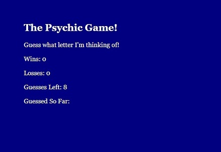
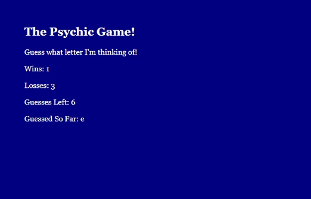

# User vs. Computer Psychic Letter Guess Game
___

This quick, simple JavaScript game is essentially a letter guessing game that users can play against 'the eviiiiil computer' to see how many times they are able to guess the correct letter the computer is thinking of.  It was built with HTML and JavaScript, and can easily be ran by following the hosted link.  Or you could simply cloning the repo here and navigate to the 'index.html' page.
___

___

___

This game was fairly basic to create, using basic HTML and then linking the JavaScript file to the page so that would randomly assign a letter to the computer each round.  The user is given eight (8) guesses for each letter, and the score is kept for each Win and Loss.  So load it up and see how many Wins you can get!  Good luck!
