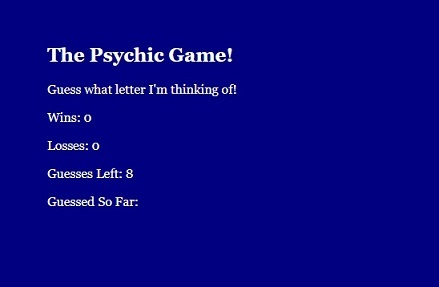

# User vs. Computer Psychic Letter Guess Game!
___

This quick, simple JavaScript game is essentially a letter guessing game that users can play against 'the eviiiil computer' to see how many times they are able to guess the correct letter that the computer is thinking of.  It was built with HTML, CSS and JavaScript, and can easily be ran by following the hosted link.  Or by simply cloning the repo and navigating to the 'index.html' page.
___

___

___

This game was fairly basic to code and create, using basic HTML and CSS, and then linking the external JavaScript file to the page so that a letter would be randomly assigned to the computer's guess each round.  The user is given eight (8) guesses for each letter each round, and a scoreboard is added to keep track of each Win and Loss.  So load it up and see how many Wins you can get!  Good luck!

## Built With

* [HTML5]
* [CSS3]
* [JavaScript]

## Authors

* **Matt Williams** - *Initial work* - [M Williams Portfolio](https://mattwills09.github.io/portfolio.html)
